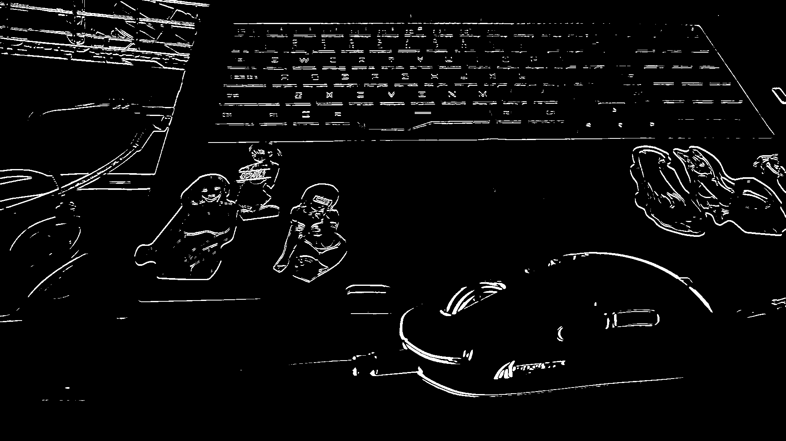

#   Проект лабораторной работы №3 по дисциплине "Системы копьютерного зрения"
##  Основная информация о задании
&ensp; Необходимо детектировать движущийся объект на статичном фоне. Паралельно рисовать траекторию движения.

## Видео для обработки

&ensp; Для выполнения работы было снятно видео, на котором происходит перемещение мышки за провод. Есть лёгкое дрожание камеры, от чего образуются переодически графические артефакты. Видеофайлы, исходные, лежат в корне репрезитория.

## Первый алгоритм обработки

### Основная идея и процесс работы

&ensp; Первый алгоритм строится на переводе изображения в тона серого и перевода изображения в контура, а после отслеживать смещение контуров и по ним, если они имеют досточно большое смещение - отрисовывать траекторию. На изображении ниже наглядно видно, что приосходит в этот момент с с изображением. Фактически, так изображение покадрово разибрается.

### Результат работы 

&ensp; Как итог, получается видео с трекингом зон смещения, что позволяет в дальнейшем определять центры этих зон и соеденять их между собой. Метод не отличается особой надёжностью и универсальностью, однако, если иметь достаточно исходных материалов и примерное знание обстановки, то можно научить метод рисовать примерную кривую движения траектории.

&ensp; В каждый момент времени помимо трекинга центров зон, происходит вырезание зон с изображения в система RGB с переносом на чёрный фон, чтобы наглядно видеть перемещение объекта.

