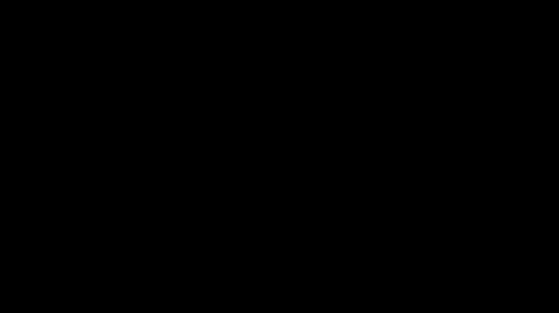
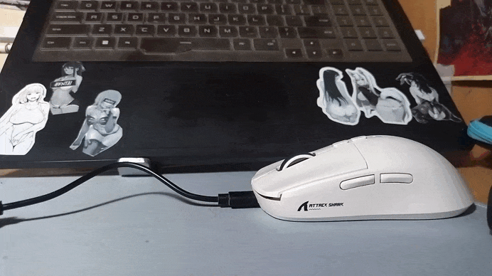
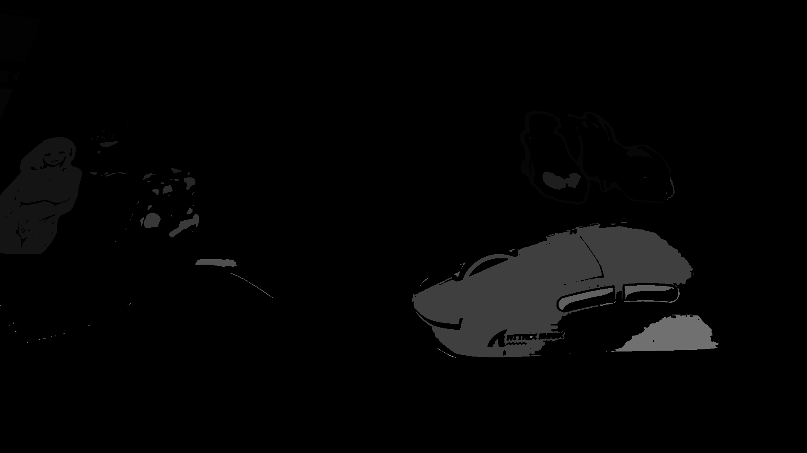
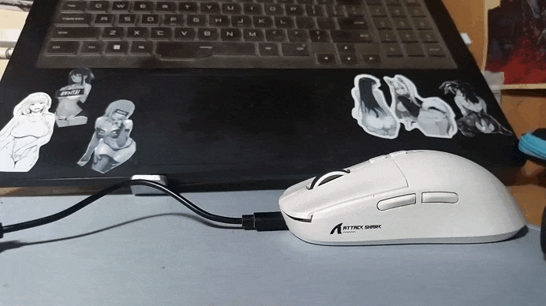

#   Проект лабораторной работы №3 по дисциплине "Системы копьютерного зрения"
##  Основная информация о задании
&ensp; Необходимо детектировать движущийся объект на статичном фоне. Паралельно рисовать траекторию движения.

## Видео для обработки

&ensp; Для выполнения работы было снятно видео, на котором происходит перемещение мышки за провод. Есть лёгкое дрожание камеры, от чего образуются переодически графические артефакты. Видеофайлы, исходные, лежат в корне репрезитория.

&ensp; &ensp; &ensp; &ensp; &ensp; &ensp; &ensp; &ensp; &ensp; &ensp; &ensp; &ensp; 

## Первый алгоритм обработки

### Основная идея и процесс работы

&ensp; Первым шагом стоит перевод в тона серого, после чего изображение обрабатывается гауссовым фильтром для снижения влияния мелких помех. Следующим этапом становится

&ensp; &ensp; &ensp; &ensp; &ensp; &ensp; &ensp; &ensp; &ensp; &ensp; &ensp; &ensp; 

&ensp; Первый алгоритм строится на переводе изображения в тона серого и перевода изображения в контура, а после отслеживать смещение контуров и по ним, если они имеют досточно большое смещение - отрисовывать траекторию. На изображении ниже наглядно видно, что приосходит в этот момент с с изображением. Фактически, так изображение покадрово разибрается.

&ensp;  
### 1. Предварительная обработка кадров  
- Конвертация в градации серого:  
  Формула: 0.299*R + 0.587*G + 0.114*B  
- Гауссово размытие (ядро 5x5):  
  Устраняет шумы и подготавливает данные для анализа.

&ensp;  
### 2. Детекция движения  
- Вычисление разницы кадров:  
  diff = |frame(t) - frame(t-1)|  
- Адаптивная пороговая обработка:  
  Порог = max(25, 95-й перцентиль значений diff)  
- Морфологическое закрытие:  
  Устраняет шумы и заполняет разрывы (ядро 5x5).

&ensp;  
### 3. Анализ контуров  
- Алгоритм Suzuki85 для поиска контуров.  
- Фильтрация по площади:  
  * min_object_area = 200 (игнорирует шумы)  
  * max_object_area = 5000 (исключает артефакты)  
- Выпуклая оболочка (convex hull):  
  Сглаживает форму объекта.

&ensp;  
### 4. Вычисление характеристик  
- Моменты изображения:  
  M00 = ΣI(x,y), M10 = Σx*I(x,y), M01 = Σy*I(x,y)  
- Центр масс:  
  cx = M10 / M00, cy = M01 / M00  
- Ограничивающий прямоугольник (bounding box).

---

## Визуализация

&ensp;  
### 1. Отрисовка объекта  
- Контур: зеленая линия (толщина 2px).  
- Центр: красный квадрат 6x6px.  

&ensp;  
### 2. Траектория  
- Синие линии между точками центра.  
- Логика сегментов:  
  * max_line_length = 100px (макс. расстояние между точками).  
  * Новый сегмент при превышении расстояния.  

---

## Параметры настройки

| Параметр            | Значение по умолчанию | Описание                   |
|---------------------|-----------------------|----------------------------|
| max_line_length     | 100px                 | Макс. длина линии          |
| min_object_area     | 200px²                | Мин. площадь объекта       |
| max_object_area     | 5000px²               | Макс. площадь объекта      |
| detection_region_y  | None                  | Ограничение зоны детекции  |

### Результат работы 

&ensp; Как итог, получается видео с трекингом зон смещения, что позволяет в дальнейшем определять центры этих зон и соеденять их между собой. Метод не отличается особой надёжностью и универсальностью, однако, если иметь достаточно исходных материалов и примерное знание обстановки, то можно научить метод рисовать примерную кривую движения траектории.

&ensp; &ensp; &ensp; &ensp; &ensp; &ensp; &ensp; &ensp; &ensp; &ensp; &ensp; &ensp;

&ensp; В каждый момент времени помимо трекинга центров зон, происходит вырезание зон с изображения в система RGB с переносом на чёрный фон, чтобы наглядно видеть перемещение объекта.

&ensp; &ensp; &ensp; &ensp; &ensp; &ensp; &ensp; &ensp; &ensp; &ensp; &ensp; &ensp;

## Второй алгоритм обработки

&ensp; Второй алгоритм будет во многом похож на работу второй лабораторной работы, поэтому, часть идей будет взята от туда. Но не в полной мере, так как это не имеет глобального смысла, так как нет гарантии, что блоб будет появляться в нужном месте пространства (точнее, что он будет привязан к объекту и возникает проблема, если блоб скроется с изображения).

&ensp; Однако, часть идей из данной работы можно перенести на данный проект, в частности, работу областями. Но мы попробуем обработать другое видео.

&ensp; &ensp; &ensp; &ensp; &ensp; &ensp; &ensp; &ensp; &ensp; &ensp; &ensp; &ensp; 

&ensp; В чём заключается идея ? Изображение будет легко биноризоваться, так как на нём не так много светлых объектов и мы сможем их легко детектировать (из светлых объектов: мышка, наклейки). При этом мышка является одним из наиболее крупным объектом, что существенно упростит задачу работы алгоритма.

&ensp; После бинаризации будет идти процесс разбиения на области, прмер разбиения показан ниже. В общей сложности, в среднем, находится около 170-200 областей, при этом в дальнейшем мы будем откидывать области меньше определённого размера, чтобы не вводить путанности, более того, мышка у нас предствляет собой наиболее крупный объект на протяжении практически всего видео. Ниже приведён пример работы алгоритма без уменьшения числа областей.

&ensp; &ensp; &ensp; &ensp; &ensp; &ensp; &ensp; &ensp; &ensp; &ensp; &ensp; &ensp; 

&ensp; Теперь будем вычислять центры координат областей. Можно вычислять через центр масс, однкао, мы прибегнем к апроксимации зоны дл прямоугольника и вычисления его центра. Для этого достаточно определить границы области (найти крайний левый верхний пиксель и крайний нижний правый пиксель), а после вычислить центр.

&ensp; Таким образом мы будем получать центры областей всех зон на первом и втором кадре, а после сравнивать данные центры относительно друг друга, вычисляя расстояния между ними. Вероятнее всего, что между кадрами будет несерьёзное смещение. То есть если координата на одном кадре, находится в определённой обалсти на другом кадре (в области от центра на прошлом кадре), то можно будет предположить, что они являются одними и теми же областями. Исходя из этого предположения, задав определённый порог по минимальному смещению (так как у нас может быть тряска камеры и смещение на пару пикселей будет в любом случаи (особенность видео), то какие-то более значимые смещения гарантированно будут движением.

&ensp; При этом так же ограничим предельные смещения, так как возможны проскакивания среди определяемых областей, и слишком сильные смещения не возможны.

&ensp; &ensp; &ensp; &ensp; &ensp; &ensp; &ensp; &ensp; &ensp; &ensp; &ensp; &ensp; 

